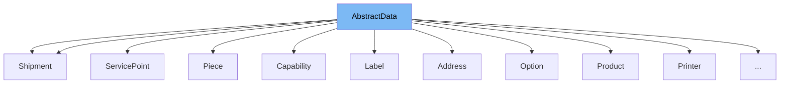

This document will cover the `AbstractData` class in the DHL Magento 2 plugin. We'll cover:

1. What is `AbstractData`.
2. Variables and functions in `AbstractData`.
3. An example of how to use `AbstractData`.



# What is AbstractData

`AbstractData` is an abstract class in the DHL Magento 2 plugin. It is used as a base class for other classes in the plugin. It provides common functionality for handling data, such as converting data to JSON, removing nulls from JSON, and converting arrays to nested objects.

<SwmSnippet path="/Model/Data/AbstractData.php" line="7">

---

# Variables and functions

The variable `objectManager` is used to store the object manager instance. It is used for creating new instances of classes.

```hack
    private $objectManager;
```

---

</SwmSnippet>

<SwmSnippet path="/Model/Data/AbstractData.php" line="9">

---

The constructor function is used to initialize the `objectManager` and set the array if provided.

```hack
    public function __construct(
        \Magento\Framework\ObjectManagerInterface $objectmanager,
        $automap = []
    ) {
        $this->objectManager = $objectmanager;
        $this->setArray($automap);
    }
```

---

</SwmSnippet>

<SwmSnippet path="/Model/Data/AbstractData.php" line="17">

---

The function `setArray` is used to set the properties of the class based on the provided array.

```hack
    public function setArray($array = [])
    {
        if (!is_array($array) || empty($array)) {
            return;
        }

        $me = $this;
        $properties = function () use ($me) {
            return get_object_vars($me);
        };

        $classMap = $this->getClassMap();
        $classArrayMap = $this->getClassArrayMap();

        foreach ($properties() as $key => $value) {
            if (array_key_exists($key, $array)) {
                if (is_array($array[$key])) {
                    if (array_key_exists($key, $classArrayMap)) {
                        // Class array mapper
                        $class = $classArrayMap[$key];
                        foreach ($array[$key] as $entry) {
```

---

</SwmSnippet>

<SwmSnippet path="/Model/Data/AbstractData.php" line="59">

---

The function `toJSON` is used to convert the class properties to a JSON string.

```hack
    public function toJSON($removeNulls = false)
    {
        $json = json_encode($this);
        if ($removeNulls) {
            $json = $this->removeNulls($json);
        }
        return $json;
    }
```

---

</SwmSnippet>

<SwmSnippet path="/Model/Data/AbstractData.php" line="68">

---

The function `toArray` is used to convert the class properties to an array.

```hack
    public function toArray($removeNulls = false)
    {
        $json = $this->toJSON($removeNulls);
        return json_decode($json, true);
    }
```

---

</SwmSnippet>

<SwmSnippet path="/Model/Data/Api/Request/Shipment/Addressee/Address.php" line="7">

---

# Usage example

The `Address` class extends `AbstractData`. It defines several public properties that represent the address of an addressee. The `AbstractData` functionality is used to handle these properties.

```hack
class Address extends AbstractData
{
    public $countryCode;
    public $postalCode;
    public $city;
    public $street;
    public $number;
    public $isBusiness;
    public $addition;
}
```

---

</SwmSnippet>

&nbsp;

*This is an auto-generated document by Swimm AI 🌊 and has not yet been verified by a human*

<SwmMeta version="3.0.0" repo-id="Z2l0aHViJTNBJTNBZGhsLW1hZ2VudG8yLXBsdWdpbiUzQSUzQWdpbGFkbmF2b3Q=" repo-name="dhl-magento2-plugin"><sup>Powered by [Swimm](/)</sup></SwmMeta>
