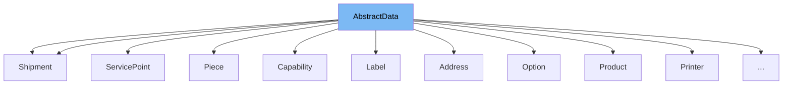

This document will cover the `AbstractData` class in the DHL Magento 2 plugin. We'll cover:\\n1. What `AbstractData` is and its purpose.\\n2. The variables and functions defined in `AbstractData`.\\n3. An example of how `AbstractData` is used in `Capability`.



# What is AbstractData

`AbstractData` is an abstract class in the DHL Magento 2 plugin. It is located in the `Model/Data` directory. This class is used as a base class for other classes in the plugin. It provides common functionality for handling data, such as converting data to JSON, removing nulls from JSON data, and converting arrays to nested objects.

<SwmSnippet path="/Model/Data/AbstractData.php" line="7">

---

# Variables and functions

The private variable `objectManager` is used to store an instance of the `ObjectManagerInterface`. This is used for creating new objects within the class.

```hack
    private $objectManager;
```

---

</SwmSnippet>

<SwmSnippet path="/Model/Data/AbstractData.php" line="9">

---

The constructor function `__construct` is used to initialize the `objectManager` variable and set the array using the `setArray` function.

```hack
    public function __construct(
        \Magento\Framework\ObjectManagerInterface $objectmanager,
        $automap = []
    ) {
        $this->objectManager = $objectmanager;
        $this->setArray($automap);
    }
```

---

</SwmSnippet>

<SwmSnippet path="/Model/Data/AbstractData.php" line="17">

---

The function `setArray` is used to set the properties of the class based on the provided array. It uses the `getClassMap` and `getClassArrayMap` functions to map the array to the class properties.

```hack
    public function setArray($array = [])
    {
        if (!is_array($array) || empty($array)) {
            return;
        }

        $me = $this;
        $properties = function () use ($me) {
            return get_object_vars($me);
        };

        $classMap = $this->getClassMap();
        $classArrayMap = $this->getClassArrayMap();

        foreach ($properties() as $key => $value) {
            if (array_key_exists($key, $array)) {
                if (is_array($array[$key])) {
                    if (array_key_exists($key, $classArrayMap)) {
                        // Class array mapper
                        $class = $classArrayMap[$key];
                        foreach ($array[$key] as $entry) {
```

---

</SwmSnippet>

<SwmSnippet path="/Model/Data/AbstractData.php" line="59">

---

The function `toJSON` is used to convert the class properties to a JSON string. It uses the `removeNulls` function to optionally remove null values from the JSON string.

```hack
    public function toJSON($removeNulls = false)
    {
        $json = json_encode($this);
        if ($removeNulls) {
            $json = $this->removeNulls($json);
        }
        return $json;
    }
```

---

</SwmSnippet>

<SwmSnippet path="/Model/Data/AbstractData.php" line="68">

---

The function `toArray` is used to convert the class properties to an array. It uses the `toJSON` function to first convert the properties to a JSON string.

```hack
    public function toArray($removeNulls = false)
    {
        $json = $this->toJSON($removeNulls);
        return json_decode($json, true);
    }
```

---

</SwmSnippet>

<SwmSnippet path="/Model/Data/Api/Response/Capability.php" line="7">

---

# Usage example

The `Capability` class extends `AbstractData`, demonstrating how `AbstractData` is used as a base class. It defines its own properties and overrides the `getClassMap` and `getClassArrayMap` functions to provide its own mapping.

```hack
class Capability extends AbstractData
{
    public $rank;
    public $fromCountryCode;
    public $toCountryCode;
    /** @var \DHLParcel\Shipping\Model\Data\Api\Response\Capability\Product */
    public $product;
    /** @var \DHLParcel\Shipping\Model\Data\Api\Response\Capability\ParcelType */
    public $parcelType;
    /** @var \DHLParcel\Shipping\Model\Data\Api\Response\Capability\Option[] */
    public $options;

    protected function getClassMap()
    {
        return [
            'product'    => 'DHLParcel\Shipping\Model\Data\Api\Response\Capability\Product',
            'parcelType' => 'DHLParcel\Shipping\Model\Data\Api\Response\Capability\ParcelType',
        ];
    }

    protected function getClassArrayMap()
```

---

</SwmSnippet>

&nbsp;

*This is an auto-generated document by Swimm AI 🌊 and has not yet been verified by a human*

<SwmMeta version="3.0.0" repo-id="Z2l0aHViJTNBJTNBZGhsLW1hZ2VudG8yLXBsdWdpbiUzQSUzQWdpbGFkbmF2b3Q=" repo-name="dhl-magento2-plugin"><sup>Powered by [Swimm](/)</sup></SwmMeta>
