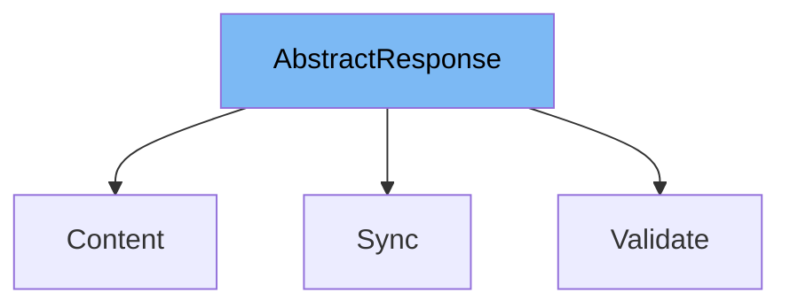

This document will cover the `AbstractResponse` class in the DHL Magento 2 plugin. We'll cover:

1. What `AbstractResponse` is and its purpose.
2. The variables and functions defined in `AbstractResponse`.
3. An example of how `AbstractResponse` is used in the `Sync` class.



# What is AbstractResponse

`AbstractResponse` is an abstract class in the DHL Magento 2 plugin. It extends the `Action` class from the Magento Framework. The purpose of `AbstractResponse` is to provide a method for creating an instant phtml view. This is useful for rendering dynamic content in the Magento frontend.

<SwmSnippet path="/Controller/AbstractResponse.php" line="15">

---

# Variables and functions

The function `getTemplate` is defined in `AbstractResponse`. It takes two parameters: `$id` and `$data`. `$id` is used to create a block with a specific id, and `$data` is used to set data for the block. The function returns the HTML of the block.

```hack
    protected function getTemplate($id, $data = [])
    {
        return $this->resultFactory->create(\Magento\Framework\Controller\ResultFactory::TYPE_LAYOUT)
            ->getLayout()
            ->createBlock('DHLParcel\Shipping\Block\Ajax', $id)
            ->setData($data)
            ->setTemplate($id . '.phtml')
            ->setArea(\Magento\Framework\App\Area::AREA_FRONTEND)
            ->setIsSecureMode(true)
            ->toHtml();
```

---

</SwmSnippet>

<SwmSnippet path="/Controller/ServicePoint/Sync.php" line="8">

---

# Usage example

The `Sync` class extends `AbstractResponse`. It uses the `getTemplate` function from `AbstractResponse` to create a phtml view. The `execute` function in `Sync` is an example of how to use `AbstractResponse`. It gets data from a post request, sets the data in the checkout session, and then returns a JSON response.

```hack
class Sync extends AbstractResponse
{

    protected $checkoutSession;

    public function __construct(
        \Magento\Framework\App\Action\Context $context,
        CheckoutSession $checkoutSession
    ) {
        parent::__construct($context);
        $this->checkoutSession = $checkoutSession;
    }

    public function execute()
    {
        $data = $this->getRequest()->getPost();
        $servicePointId = $data->servicepoint_id ?: null;
        $servicePointCountry = $data->servicepoint_country ?: null;
        $servicePointName = $data->servicepoint_name ?: null;
        $servicePointPostcode = $data->servicepoint_postcode ?: null;

```

---

</SwmSnippet>

&nbsp;

*This is an auto-generated document by Swimm AI 🌊 and has not yet been verified by a human*

<SwmMeta version="3.0.0" repo-id="Z2l0aHViJTNBJTNBZGhsLW1hZ2VudG8yLXBsdWdpbiUzQSUzQWdpbGFkbmF2b3Q=" repo-name="dhl-magento2-plugin"><sup>Powered by [Swimm](/)</sup></SwmMeta>
