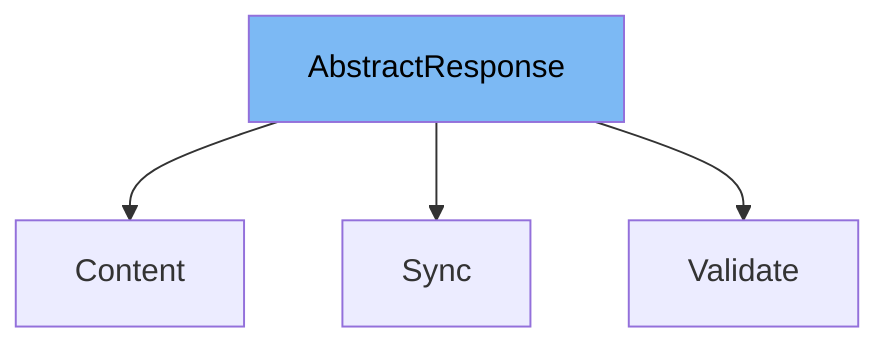

This document will cover the `AbstractResponse` class in the dhl-magento2-plugin. We'll cover:\\n1. What is `AbstractResponse`\\n2. Variables and functions in `AbstractResponse`\\n3. Usage example of `AbstractResponse`.



# What is AbstractResponse

`AbstractResponse` is an abstract class in the DHL Magento 2 plugin. It extends the `Magento\Framework\App\Action\Action` class and provides a method for creating an instant phtml view. This class is used as a base class for other classes in the plugin that need to generate phtml views.

<SwmSnippet path="/Controller/AbstractResponse.php" line="15">

---

# Variables and functions

The `getTemplate` function is a protected method in the `AbstractResponse` class. It takes two parameters: `$id` and `$data`. `$id` is used to set the template and `$data` is used to set the data for the block. The function creates a layout result, gets the layout, creates a block with the given `$id` and `$data`, sets the template, sets the area to frontend, sets secure mode to true, and finally returns the HTML of the block.

```hack
    protected function getTemplate($id, $data = [])
    {
        return $this->resultFactory->create(\Magento\Framework\Controller\ResultFactory::TYPE_LAYOUT)
            ->getLayout()
            ->createBlock('DHLParcel\Shipping\Block\Ajax', $id)
            ->setData($data)
            ->setTemplate($id . '.phtml')
            ->setArea(\Magento\Framework\App\Area::AREA_FRONTEND)
            ->setIsSecureMode(true)
            ->toHtml();
```

---

</SwmSnippet>

<SwmSnippet path="/Controller/ServicePoint/Content.php" line="7">

---

# Usage example

The `Content` class in `Controller/ServicePoint/Content.php` is an example of a class that extends `AbstractResponse`. It overrides the `execute` method and uses the `getTemplate` method from `AbstractResponse` to create a phtml view for a service point modal.

```hack
class Content extends AbstractResponse
{

    public function execute()
    {
        return $this->resultFactory
            ->create(\Magento\Framework\Controller\ResultFactory::TYPE_JSON)
            ->setData([
                'status'  => 'success',
                'data'    => [
                    'view' => $this->getTemplate('servicepoint.modal', [
                    ])
                ],
                'message' => null,
            ]);
    }
}
```

---

</SwmSnippet>

&nbsp;

*This is an auto-generated document by Swimm AI 🌊 and has not yet been verified by a human*

<SwmMeta version="3.0.0" repo-id="Z2l0aHViJTNBJTNBZGhsLW1hZ2VudG8yLXBsdWdpbiUzQSUzQWdpbGFkbmF2b3Q=" repo-name="dhl-magento2-plugin"><sup>Powered by [Swimm](/)</sup></SwmMeta>
